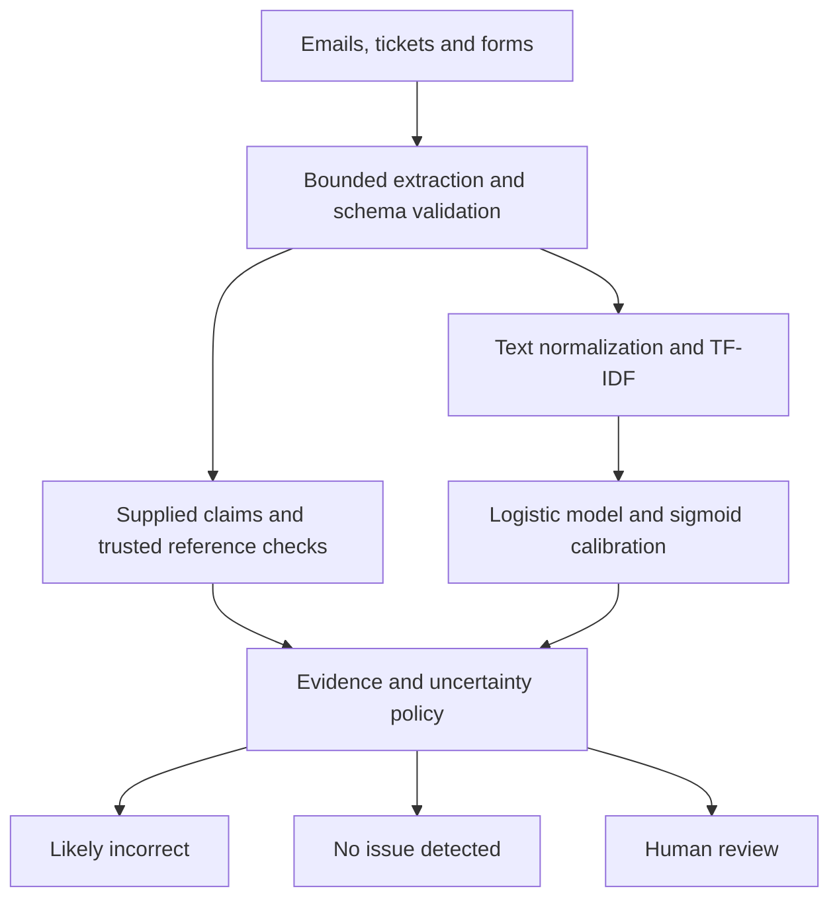

# Document screening: incorrect information and fraud-risk triage

A runnable Python project for screening emails, tickets and forms. It combines a trained text model, structured reference checks and a human-review decision. Includes an API, streaming batch pipeline, training/evaluation, test suite, Dockerfile and GitHub Actions CI.

**Scope:** incorrect information is not the same as intentional fraud. This system does not establish intent, verify arbitrary natural-language facts, or prove a document is genuine. `no_issue_detected` means only that the supplied fields match the supplied reference and the text risk is low. It is not a certification that every statement is true.

**Readiness:** the implementation is executable and ready to commit. It is not a trained, validated company-specific fraud detector. The bundled 36-row synthetic dataset is solely an execution fixture. Real production use requires domain labels, trusted reference integration, validation and operational deployment controls. No paid API, model download or GPU is required. Installation needs package-index access, or an internal wheel mirror.

## 1. Requirements and installation

Use **Python 3.11, 3.12 or 3.13**. Python 3.14 is deliberately excluded from this tested dependency set. Commands assume your terminal is in the extracted `document-screening` folder containing `README.md` and `app/`. Recommended: 2 CPU cores and 2 GB RAM for the small demo; measure requirements on real data.

### Windows PowerShell

```powershell
cd E:\document-screening
py --list
py -3.13 -m venv .venv
.\.venv\Scripts\python.exe -m pip install --upgrade pip
.\.venv\Scripts\python.exe -m pip install -r requirements-dev.txt -c constraints.txt
.\.venv\Scripts\python.exe -m pytest -q
.\.venv\Scripts\python.exe -m app.train --demo
.\.venv\Scripts\python.exe -m app.batch
Get-Content outputs\predictions.jsonl
Get-Content artifacts\evaluation.json
```

If Python 3.13 is not installed but 3.12 or 3.11 is, replace `py -3.13` accordingly. Using the virtual environment's full Python path avoids activation-policy problems and accidentally installing packages into another Python. Do not run training before installing dependencies.

Alternatively, run the included `run_demo.ps1` in PowerShell after inspecting it. It selects Python 3.13, installs dependencies, runs tests, trains and predicts. Follow the individual commands above if local script execution policy blocks it.

### Linux / macOS

```bash
cd document-screening
python3 --version
python3 -m venv .venv
.venv/bin/python -m pip install --upgrade pip
.venv/bin/python -m pip install -r requirements-dev.txt -c constraints.txt
.venv/bin/python -m pytest -q
.venv/bin/python -m app.train --demo
.venv/bin/python -m app.batch
cat outputs/predictions.jsonl
```

Or inspect and run `bash run_demo.sh`. On Linux, your OS may need its Python venv package. Thereafter use `.venv/bin/python`; Windows examples below use `.\.venv\Scripts\python.exe`.

`requirements.txt` pins direct runtime dependencies. `constraints.txt` pins the tested transitive dependency set. `requirements-dev.txt` adds pytest and the HTTP test client. For inference without tests, install `requirements.txt` with `-c constraints.txt`.

## 2. What the demo produces

- `artifacts/model.json`: portable TF-IDF, logistic regression and sigmoid calibration parameters; no pickle or joblib loading.
- `artifacts/evaluation.json`: held-out test metrics, split counts and input-data SHA-256.
- `outputs/predictions.jsonl`: one result per input line, or a validation error for that line.

For `data/sample_documents.jsonl` the expected decisions are:

| ID | Decision | Reason |
|---|---|---|
| invoice-mismatch | likely_incorrect | Supplied invoice total contradicts the reference |
| matching-record | review | Demo text model is not validated |
| suspicious-message | review | Demo text model is not validated |
| ambiguous | review | Insufficient text |
| unknown-domain | review | Low training-vocabulary coverage |

The demo deliberately sends model-based decisions to review. Reference mismatches can still be flagged because they are deterministic checks, provided the reference is trustworthy. This flag identifies an inconsistency; it does not establish fraud.

`examples/` includes outputs from the verified run so you can inspect the format before installation. Those files are synthetic and contain no customer information.

## 3. Architecture / solution design



The same `ScreeningService` powers the CLI and HTTP API. Model training is offline; API workers load one fixed model at startup. No model training or third-party model calls occur during classification.

Implemented modules:

| File | Purpose |
|---|---|
| `app/ingest.py` | Local UTF-8 text, email body and JSON form extraction |
| `app/schemas.py` | Bounded document and batch validation |
| `app/model.py` | Normalization, validated JSON model loading and inference |
| `app/train.py` | Split validation, fitting, calibration and evaluation |
| `app/service.py` | Reference checks and selective decision policy |
| `app/batch.py` | Streaming JSONL scoring with per-line errors |
| `app/api.py` | API key authentication, health checks, payload limits and redacted validation errors |
| `app/benchmark.py` | Reproducible local inference throughput measurement |

## 4. Model choices and implementation

**Implemented baseline:** word/unigram and bigram TF-IDF, logistic regression, then sigmoid calibration fitted on a separate calibration split. This is fast on CPU, has small artifacts, works without external services and provides an auditable baseline. Logistic regression learns labels from the supplied corpus; it does not check factual truth by itself. Calibration also depends on representative data and adequate sample size.

**Alternative choices for later evaluation:** a fine-tuned compact transformer for semantic variation; a multilingual transformer for non-English documents; or retrieval plus a language model to compare extracted statements with authoritative evidence. These alternatives are design options, not bundled dependencies or implemented features. A language model should return cited evidence and abstain when evidence is missing; use it only after measuring the added latency, cost and reliability against this baseline.

Preprocessing uses Unicode NFKC, case folding, bounded markup removal, whitespace normalization, and placeholder replacement for email addresses and URLs. Numbers remain in the text. Templates, negations and relevant words are preserved. Email/URL replacement reduces some identifiers; it is **not comprehensive PII anonymization**. Names, IDs, phone numbers and amounts may remain. Training artifacts can reveal vocabulary; protect them like derived customer data.

Models are stored as JSON coefficients, vocabulary and IDF values. Loading does not deserialize executable Python objects. The artifact includes schema checks, shape checks and finite-value checks. The SHA-derived model version identifies bytes; it does not authenticate provenance. Protect the artifact directory and use an approved release process.

### Handling ambiguous inputs

Decisions follow this precedence:

1. A supported claim differs from the supplied reference: `likely_incorrect`, with a field-level `mismatch` check.
2. Fewer than five normalized words, or known-token coverage below 0.60: `review`.
3. Synthetic demo model: `review` for all remaining cases.
4. A validated non-demo model score >= 0.90: `likely_incorrect`.
5. Score <= 0.10 **and every supplied claim has a supported, valid, matching reference**: `no_issue_detected`.
6. All other cases, including missing claims/references: `review`.

The vocabulary check is a basic out-of-distribution heuristic, not a language detector or complete uncertainty estimator. Unsupported languages, novel domains, sarcasm, conflicting context and errors in extraction need reviewer attention and domain testing. Reviewer labels should be stored in your case-management system and exported into the next curated training dataset; this project returns review decisions but does not include a reviewer UI or persistent case-management queue.

Supported structured fields: `invoice_total`, `currency`, `customer_id`, `account_status`. Amounts use `Decimal` comparison, require finite nonnegative plain numeric values, and accept `950` as equal to `950.00`. Thousands separators such as `1,000` are rejected for comparison; normalize them upstream. Customer IDs are case sensitive; currency/status are trimmed and case insensitive. Unknown fields, malformed values and missing references are not silently treated as matches.

No document is automatically rejected, penalized or marked as confirmed fraud.

## 5. Input contract and trusted evidence

Each JSONL line is one object:

```json
{
  "id": "invoice-001",
  "source": "form",
  "text": "Please verify the submitted invoice and customer account details.",
  "claims": {"invoice_total": "1250.00", "currency": "INR"},
  "reference": {"invoice_total": "950.00", "currency": "INR"}
}
```

`id` and `text` are required; `source` defaults to `form` and allows `email`, `ticket`, `form`. `claims` and `reference` default to empty maps. Unknown top-level fields are rejected. Maximum text length is 30,000 characters. API batches contain 1–100 documents with unique IDs. Repeated IDs across separate CLI lines or API requests are not deduplicated; use a durable upstream document ID and idempotent writes.

**Trust boundary:** only an authorized internal integration should populate `reference` from a database, CRM or ledger using the correct document/entity identity. Do not let untrusted end users submit their own reference values or overwrite ledger values. API key access identifies the internal caller, not an independent proof of the reference. The included reference fields are an integration contract; there is no live database connector. Include evidence provenance, lookup timestamp and access controls in your upstream system. Stale or incorrectly joined references create false flags.

Claims are structured values supplied by the integration. The baseline does not extract arbitrary claims or amounts from free text. A mismatch is evaluated only for supplied supported claims, and a low text score cannot certify unsupplied facts.

## 6. Run the complete document pipeline

### Classify existing JSONL

```powershell
.\.venv\Scripts\python.exe -m app.train --demo
.\.venv\Scripts\python.exe -m app.batch --input data/sample_documents.jsonl --output outputs/predictions.jsonl --model artifacts/model.json
```

The CLI processes batches of 100, preserves input order, emits one output per line and continues past malformed records. Empty lines are invalid records. Results include decision, decision basis, model probability, vocabulary coverage, redacted field checks, reason codes and model version. Scores are learned estimates, not certainty of fraud. Output files are overwritten on each run; choose distinct paths to preserve previous runs. Input and output paths cannot be identical.

### Ingest a local folder first

```powershell
.\.venv\Scripts\python.exe -m app.ingest --folder data/inbox --output outputs/ingested.jsonl --errors outputs/ingestion_errors.jsonl
.\.venv\Scripts\python.exe -m app.batch --input outputs/ingested.jsonl --output outputs/ingested_predictions.jsonl
```

Supported files are UTF-8 `.txt`, RFC `.eml` email bodies, and `.json` forms using the document schema. Subfolders are scanned. File size is limited to 1 MB; symbolic links are rejected. For text/email, IDs are hashes of relative paths, so renaming changes the ID and modifying contents at the same path does not. JSON forms preserve their supplied IDs.

Email attachments are not parsed; HTML-only email content has markup removed during normalization. Scanned PDFs, images, DOCX, compressed files, attachments and encrypted documents are **not supported** in this baseline. Ingestion records them in the error file. Add a sandboxed PDF/OCR extraction stage with quality scoring and an explicit review path before admitting such content. Do not silently assume extraction succeeded.

Ingestion output/error paths must be outside the input folder. Error files contain filenames; treat those as potentially sensitive metadata.

## 7. Start the API and obtain results

Train first. In PowerShell:

```powershell
$env:API_KEY = [guid]::NewGuid().ToString("N")
$env:ALLOW_DEMO_MODEL = "true"
$env:MODEL_PATH = "artifacts/model.json"
.\.venv\Scripts\python.exe -m uvicorn app.api:app --host 127.0.0.1 --port 8000 --no-access-log
```

Keep that terminal running. Open `http://127.0.0.1:8000/` or `/docs`. In `/docs`, expand `POST /v1/classify`, click **Try it out**, enter the same API key in `x-api-key`, paste the contents of `data/sample_request.json`, then execute. `/health/live` checks the process; `/health/ready` is available after successful model loading. Health and API schema endpoints are unauthenticated for local observability; restrict their exposure at the production gateway.

For a command-line request, use a **second** PowerShell terminal in the project folder. Copy the API key from the first terminal (you can print `$env:API_KEY` before starting the server):

```powershell
$env:API_KEY = "paste-the-same-secret-from-the-server-terminal"
$headers = @{ "X-API-Key" = $env:API_KEY }
$body = Get-Content data/sample_request.json -Raw
$result = Invoke-RestMethod -Uri http://127.0.0.1:8000/v1/classify -Method Post -Headers $headers -ContentType "application/json" -Body $body
$result | ConvertTo-Json -Depth 10
$result | ConvertTo-Json -Depth 10 | Set-Content outputs/api_results.json
```

Linux/macOS equivalent:

```bash
export API_KEY="$(python3 -c 'import secrets; print(secrets.token_hex(32))')"
export ALLOW_DEMO_MODEL=true
export MODEL_PATH=artifacts/model.json
.venv/bin/python -m uvicorn app.api:app --host 127.0.0.1 --port 8000 --no-access-log
# In another terminal, set the same API_KEY and run:
curl -sS http://127.0.0.1:8000/v1/classify -H "X-API-Key: $API_KEY" -H 'Content-Type: application/json' --data-binary @data/sample_request.json
```

The API checks actual request-body bytes and rejects >1 MB, including chunked bodies. It returns 401 for missing/wrong keys, 422 for invalid schema and 413 for oversized payloads. Application logs contain request ID, method, status and duration, not text or reference values. Every normal response has `X-Request-ID`. `.env.example` documents settings; Python does not automatically load `.env`. Set environment variables explicitly or use Docker's `--env-file`.

### Docker demo

```bash
docker build -t document-screening:local .
docker run --rm -p 127.0.0.1:8000:8000 -e API_KEY=local-demo-secret-at-least-24-characters -e ALLOW_DEMO_MODEL=true document-screening:local
```

The image trains the demo fixture at build time and runs as a non-root user. This provides instant local testing, not company-model training. Do not use the example key externally. Docker engine execution was not available in the delivery environment; the native Python pipeline and HTTP API were tested.

For a real model, mount an approved model directory read-only, set `MODEL_PATH=/models/model.json`, provide a managed secret, and omit `ALLOW_DEMO_MODEL`:

```bash
docker run --rm -p 127.0.0.1:8000:8000 --env-file .env -e MODEL_PATH=/models/model.json -e ALLOW_DEMO_MODEL=false --mount type=bind,source=/absolute/path/to/approved-artifacts,target=/models,readonly document-screening:local
```

Ensure UID 10001 can read the mounted artifact. Put TLS, authentication policy, rate limiting and request timeouts at your gateway before external exposure. The included API key is a minimal internal-service control; it is not per-user authorization or a complete production identity system.

## 8. Train on company data

Gather representative documents with independently reviewed binary labels, trusted evidence, timestamps, document source, customer/case grouping, and reviewer resolution. Include benign mistakes, genuine suspicious cases, ambiguous cases and challenging negatives. Reviewers should label factual correctness according to a documented standard; do not automatically use this model's predictions as ground truth.

Required UTF-8 CSV columns:

```csv
id,text,label,group_id,split
case-001,"The receipt agrees with the verified billing record",legitimate,customer-001,train
case-002,"The payment amount contradicts the authoritative ledger",incorrect,customer-002,calibration
case-003,"The invoice contains an altered and unsupported amount",incorrect,customer-003,test
```

This three-line illustration is a schema example, not enough data to train. Provide at least five rows per class **in each split**; this is a code validation floor, not a sufficiency recommendation. Real-world datasets should contain hundreds or thousands of independently labeled examples and enough positive cases to estimate error rates.

Allocate roughly 60% train, 20% calibration and 20% test, adjusting for prevalence and sample size. **Assign splits upstream by customer/case group, ideally also by time.** Keep related conversations, templates, attachments and near duplicates in the same group; preserve a future holdout if the production task is temporal. The loader rejects duplicate normalized texts and group IDs crossing splits. It does not detect semantic near duplicates or independently verify that grouping is correct.

```powershell
.\.venv\Scripts\python.exe -m app.train --data path/to/company_training.csv --model artifacts/company_model.json --report artifacts/company_evaluation.json
$env:MODEL_PATH = "artifacts/company_model.json"
$env:ALLOW_DEMO_MODEL = "false"
```

Train without `--demo` only for company-labeled data. The bundled synthetic dataset's exact byte hash is recognized and remains demo even without the flag. Copying or modifying it does not turn it into validated data. The program cannot verify whether a new dataset is genuinely real. Production promotion is your release process's responsibility.

After training, restart API workers to load the approved artifact. Do not overwrite an active shared artifact during a rollout. Use immutable, access-controlled artifact versions, shadow evaluation, canary rollout and a rollback path. The writer uses atomic replacement for model/report files individually; those two files are not an atomic release bundle.

## 9. Evaluation and acceptance

Training fits vocabulary and classifier on `train` only. Calibration fits on `calibration` only. The untouched `test` split produces:

- Incorrect-class average precision (PR-AUC summary), ROC-AUC, precision, recall and F1 at score 0.5.
- Brier score to assess probability error.
- Confusion matrix with true rows and predicted columns ordered `[legitimate, incorrect]`.
- Score-only coverage/review rate at 0.10/0.90 and selected accuracy, or null when no examples meet thresholds.

Operational gates additionally check evidence, text quality and demo status; score-only metrics therefore **do not describe end-to-end automatic decision coverage**. The CSV evaluator tests the text model, not a ledger integration. Evaluate complete JSON documents and reference joins independently in shadow mode before deployment.

Set acceptance requirements with reviewers: precision of flagged cases, missed-incorrect rate, cost-weighted errors, false positives on legitimate documents, reference accuracy, review volume, calibration and p95 latency. Report results by email/ticket/form, language, document length, time period and relevant customer populations. Use bootstrap confidence intervals on a sufficiently large holdout. Tune thresholds on calibration/validation data according to review capacity and error costs, then evaluate once on a fresh test set. Never repeatedly tune against the test report.

Default thresholds are conservative starting values, not empirically justified business settings. API settings are `LOW_THRESHOLD`, `HIGH_THRESHOLD` and `MIN_COVERAGE`; batch exposes `--low`, `--high` and `--min-coverage`. Training evaluation exposes `--low` and `--high` for score-only selective metrics. All share the same defaults. Keep these values synchronized across training reports, API and batch when deploying approved thresholds. Drift and calibration may change even when headline accuracy looks stable.

## 10. Scaling to thousands of documents

**Implemented:** streaming CLI scoring in chunks of 100; bounded API batches; one model per process; synchronous prediction endpoints run in FastAPI's thread pool; CPU-only sparse inference. Docker limits concurrency to 32 and numerical thread counts to one. Rejected concurrency should be retried upstream with bounded backoff.

**Production expansion, not included infrastructure:** place uploads/metadata in secure object storage, enqueue durable document IDs, run separate extraction and inference workers, persist results in a relational database, and send review cases to a case-management queue. Use idempotency keys such as document ID + content hash + model version, bounded retries and a dead-letter queue. Scale workers by queue lag and measured CPU/memory; apply backpressure rather than unbounded parallelism. Prefer batch inference for throughput. API replicas should be stateless and share an immutable approved model version. Every worker loads its own model, so memory usage rises with worker count.

Run a local baseline:

```powershell
.\.venv\Scripts\python.exe -m app.benchmark --documents 10000
```

This measures only warmed-up in-process short-text inference; it excludes extraction, API, queue, database and network overhead. It cannot establish production capacity. Load-test representative documents and concurrent clients; measure p50/p95/p99 latency, throughput, memory, HTTP errors and review backlog. Monitor reason-code frequencies, score distributions, vocabulary coverage, evidence lookup failures and delayed reviewer-confirmed precision/recall. Investigate drift before retraining on curated feedback.

The application does not include an external queue, database, automatic retraining, OCR service, dashboard, tracing backend or autoscaler. Those depend on your existing infrastructure and data-governance requirements.

## 11. Tests, checks and troubleshooting

```powershell
.\.venv\Scripts\python.exe -m pytest -q
.\.venv\Scripts\python.exe -m compileall -q app
```

Tests cover JSON inference parity with the trained scikit-learn model, leakage rejection, uncertainty policy, evidence comparison, invalid data, ingestion, streamed batch errors, API authentication, request limits and demo startup restrictions. CI runs on Python 3.11/3.12/3.13. The delivered native run was verified on Python 3.12; the CI matrix is configured and has not been executed on GitHub yet.

| Symptom | Fix |
|---|---|
| No suitable Python runtime | Run `py --list`; choose installed 3.11–3.13 or install one |
| Module not found | Install requirements using the exact `.venv` Python path |
| No `artifacts/model.json` | Run `python -m app.train --demo` from project root |
| API startup fails on API_KEY | Set a random secret of at least 24 characters |
| API startup blocks demo model | For local testing explicitly set `ALLOW_DEMO_MODEL=true` |
| GET /v1/classify returns 405 | Classification requires POST and a documents body |
| Browser GET / returns a service summary | Use `/docs` to send an authenticated POST request |
| 401 | Use the same `X-API-Key` value as the server process |
| 422 | Check schema, supported source values, limits and duplicate IDs |
| All text-only demo inputs go to review | Expected: synthetic models cannot auto-decide |
| Input PDF appears in ingestion error file | Add an independently validated extraction/OCR stage |
| All real examples go to review | Inspect text coverage, score calibration, evidence completeness and thresholds; do not lower thresholds blindly |

## 12. Prepare and push to GitHub

No repository has been pushed by this delivery. To push your extracted project to a repository you control:

```bash
git init
git add .
git status
git commit -m "Add evidence-aware document screening pipeline"
git branch -M main
git remote add origin https://github.com/YOUR_USERNAME/YOUR_REPOSITORY.git
git push -u origin main
```

Review staged files before committing. `.gitignore` excludes virtual environments, secrets, trained artifacts and live outputs. Only synthetic `data/` and `examples/` are intended for Git; store real customer data outside the repository. The project deliberately leaves licensing unspecified because ownership/licensing should follow your company policy; add an appropriate license before public redistribution if needed.

## References

- [scikit-learn calibration](https://scikit-learn.org/stable/modules/calibration.html)
- [scikit-learn model persistence](https://scikit-learn.org/stable/model_persistence.html)
- [FastAPI deployment concepts](https://fastapi.tiangolo.com/deployment/concepts/)
